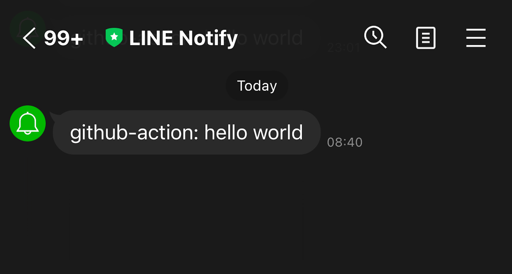

# line-notify-action
[](https://github.com/guyzsarun/line-notify-action/actions/workflows/docker-build.yml)

Github Action that sends Line notification



## Example usage

```
steps:
- name: notify
  uses: actions/hello-world-docker-action@v2
  with:
    access_token: ${{ secrets.ACCESS_TOKEN }}
    message: 'hello world'
```

## Inputs

| **Input**              	| **Required** 	| **Default**   	| **Description**                                                 	|
|------------------------	|--------------	|---------------	|-----------------------------------------------------------------	|
| `access_token`         	| true         	|               	| Access token generated from https://notify-bot.line.me/en/      	|
| `message`              	| true         	| "hello world" 	| The message to send to the corresponding access_token endpoint. 	|
| `disable_notification` 	|              	| false         	| Disable the notification if set to `true`                       	|